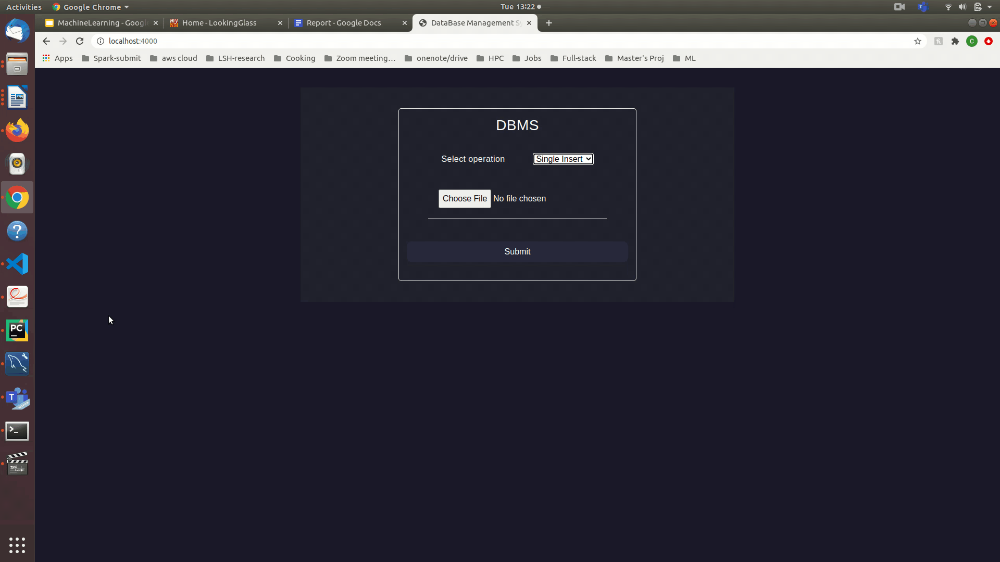
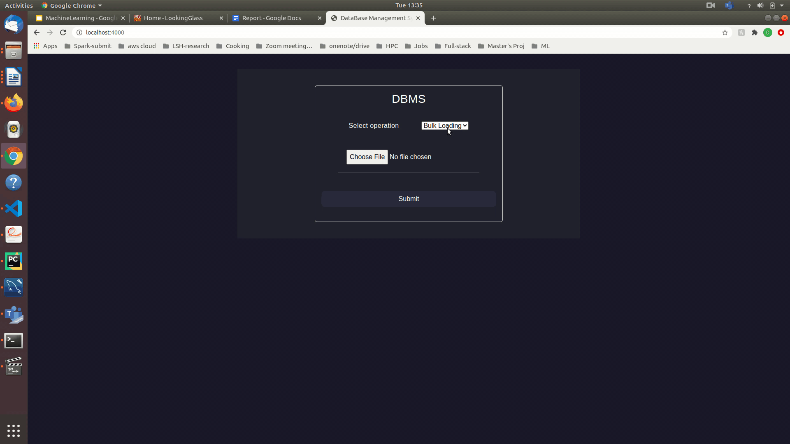

# MySQL Insertion Techniques

## How to run the Project?
1. Go inside the Project folder
2. Run the following command from the terminal.
```
npm ci
npm start
```

## Project Description
This project consists of a simple UI which interacts with mysql database by using Node Js in order to compare the insertion times of single insertion vs bulk loading in mysql.
1. Single insertion - [https://dev.mysql.com/doc/refman/8.0/en/insert.html](https://dev.mysql.com/doc/refman/8.0/en/insert.html)
2. Bulk Loading - [https://dev.mysql.com/doc/refman/8.0/en/load-data.html](https://dev.mysql.com/doc/refman/8.0/en/load-data.html)

## Stack Used
1. Html5
2. Css3
3. Node Js
4. HandleBars
5. Multer
6. Node js
7. MySQL

## Sample Data
The sample Data for insertion of 150K, 200K records into MySQL is created by using a simple python script.

## Sample Run
### Single Insertion(100k records) - Time taken - 4 minutes

### Bulk Loading(100k records) - Time taken - 2.5 seconds

